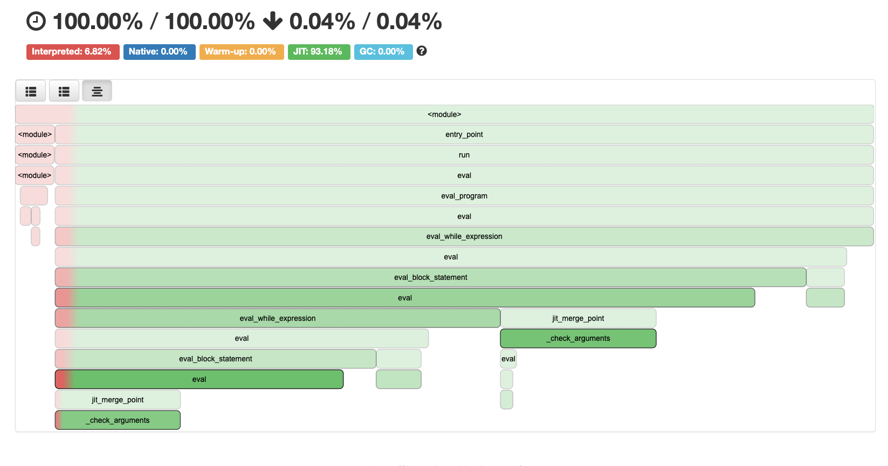

[](https://github.com/Pavel-Durov/iterpreter.rpy/actions/workflows/test.yml)
[](https://github.com/Pavel-Durov/iterpreter.rpy/actions/workflows/rpython.yml)


## kimchi.py

Interpreter called Kimchi, Inspired by a book [Writing An Interpreter In Go](https://interpreterbook.com/) but was writen in RPython.

VM:
+ SELF-Like scope environment optimization

Kimchi Support:
+ Mathematical Expressions - `2 + 4 / (2- 1)`
+ Variable Bindings - `let a = 5` 
+ Conditional Expressions - `(fn(x) { if (x == 1) {return x;} return 9; };)(1)`
+ Return statements - `let getO = fn() { return 1; }`
+ Functions & Function application & closuers - `(fn(x) { return fn(y) { return x + y; }; };)(1)(2);`
+ Higher-Order functions
+ While Loops - `let a = 0; while (a < 5){ a = a + 1; };`

Supported Data Types:

+ Integers - `1`
+ Booleans - `true, false`
+ Strings - `"Helllo"`
+ Arrays - `[1, false, "yo"]`
+ Hashes - `{ "kimchi": true, 2022: false }`

Supported Builtin Functions:
+ `len` - returns the length of  a sequence
+ `first` - returns the first element in sequence
+ `last` - returns the last element in sequence
+ `rest` - returns the tails of the sequence
+ `push` - adds element to sequence
+ `put` - prints message to stdout


## Running kimchi sample programs:
```shell
$ python ./src/main.py ${PWD}/programs/fibo.ki          
result: 
13

$ python ./src/main.py ${PWD}/programs/helloWorld.ki 
Hello World
```

## Running kimchi Repl:


```shell
$ make repl
> let a = {"a": 1, true: 2, 3:4};
> a["a"] 
1
> 22 + 22 == 44
True
```

# Local development
## Setup
```shell
$ make init-env # created conda environemnt
$ direnv allow # setup local shell session
```

### Test
```shell
$ make test
```

## Pypy Translate
```shell
$ make get-pypy-osx # OSX only - downloads and extracts pypy source code 
$ make get-pypy-linux # Linux only - downloads and extracts pypy source code 
$ make translate # translate ./src RPython to c
```

### Running Translated c files
```shell
./main-c programs/loops.ki # runs program with no optimisations
./main-c programs/loops.ki self-like # runs program with SELF-like optimisation

export BIN='bin/0.4.0/0.4.0_0ef9af68f13bc45c233617e2d2954df62ebfdd78_main-c'
PYPYLOG=jit-log-opt:${BIN}.logfile ${BIN} ./programs/loops.ki
PYPYLOG=jit-log-opt:${BIN}-self-like.logfile ${BIN} ./programs/loops.ki self-like
```

### Benchmarking
```shell
export BIN='bin/0.4.0/0.4.0_0ef9af68f13bc45c233617e2d2954df62ebfdd78_main-c'
hyperfine --warmup 10 "${BIN} ./programs/loops.ki" "${BIN} ./programs/loops.ki self-like"
hyperfine "${BIN} ./programs/loops.ki" "${BIN} ./programs/loops.ki self-like"
```
### VMProf Server

https://github.com/vmprof/vmprof-server

Build docker image and apply migrations (for a new setup or version upgrade):

```shell
docker-compose build
docker-compose run --rm vmprof-server python3 manage.py migrate
docker-compose up # Run the server inside docker container
docker-compose run --rm vmprof-server python3 manage.py generate_api_token # Generate API token
```
VMprof jit log should look something like



## Resources:

[VMProf Platform](https://vmprof.readthedocs.io/en/latest/)

[A gentle introduction to PyPy, Python performance and benchmarking](https://iamkimchi.medium.com/a-gentle-introduction-to-pypy-python-performance-and-benchmarking-3d0e5609985)

[An Efficient Implementation of SELF,a Dynamically-Typed Object-Oriented Language Based on Prototypes](https://dl.acm.org/doi/pdf/10.1145/74878.74884)

[PyPy Tooling Upgrade: JitViewer and VMProf](https://www.pypy.org/posts/2016/08/pypy-tooling-upgrade-jitviewer-and-5107430577468391432.html)

[Tutorial Part 1](https://morepypy.blogspot.com/2011/04/tutorial-writing-interpreter-with-pypy.html)

[Tutorial Part 2](https://morepypy.blogspot.com/2011/04/tutorial-part-2-adding-jit.html)

[Brainfuck](https://en.wikipedia.org/wiki/Brainfuck)
